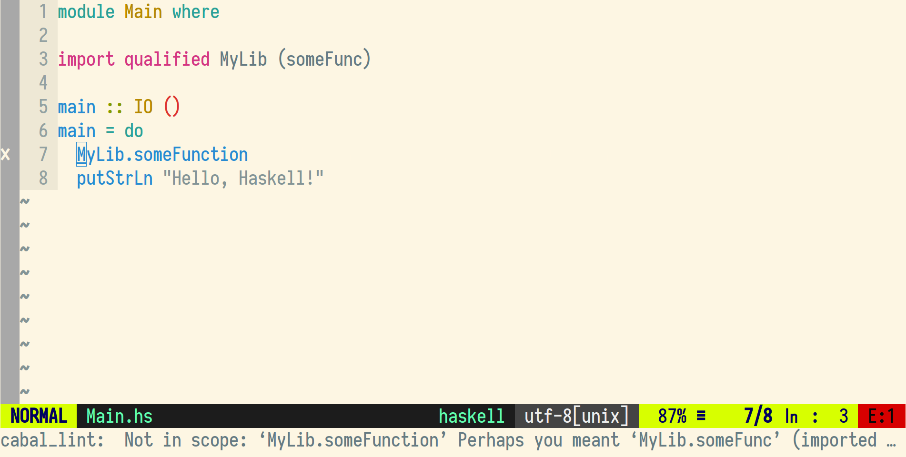

cabal-lint-neomake
==================

Introduction
------------

This small package uses the executable cabal-lint to bring helpful error messages to vim.

It uses both [cabal-lint](https://github.com/fyusuf-a/cabal-lint) whose executable should be on your path and [neomake](https://github.com/neomake/neomake).



Installation
------------

Below are just some of the methods for installing cabal-lint-neomake. Do not follow all of these instructions; just pick your favorite one. Other plugin managers exist, and cabal-lint-neomake should install just fine with any of them.

#### [vim-plug](https://github.com/junegunn/vim-plug)
```vim
call plug#begin()
Plug 'fyusuf-a/cabal-lint-neomake'
Plug 'neomake/neomake'
call plug#end()
```

And then call `:PlugInstall`

#### Vim 8+ packages

If you are using VIM version 8 or higher you can use its built-in package management; see `:help packages` for more information. Just run these commands in your terminal:

```bash
git clone https://github.com/fyusuf-a/cabal-lint-neomake ~/.vim/pack/vendor/start/cabal-lint-neomake
git clone https://github.com/neomake/neomake ~/.vim/pack/vendor/start/neomake
vim -u NONE -c "helptags ~/.vim/pack/vendor/start/cabal-lint-neomake/doc" -c q
vim -u NONE -c "helptags ~/.vim/pack/vendor/start/neomake/doc" -c q
```

Otherwise, these are some of the several 3rd-party plugin managers you can choose from. Be sure you read the instructions for your chosen plugin, as there typically are additional steps you need to take.

#### [pathogen.vim](https://github.com/tpope/vim-pathogen)

In the terminal,
```bash
git clone https://github.com/fyusuf-a/cabal-lint-neomake.git ~/.vim/bundle/cabal-lint-neomake
git clone https://github.com/neomake/neomake ~/.vim/bundle/neomake
```
In your vimrc,
```vim
call pathogen#infect()
```

Then reload vim, run `:Helptags`.

#### [Vundle.vim](https://github.com/VundleVim/Vundle.vim)
```vim
call vundle#begin()
Plugin 'fyusuf-a/cabal-lint-neomake'
Plugin 'neomake/neomake'
call vundle#end()
```

#### [apt-vim](https://github.com/egalpin/apt-vim)
```bash
apt-vim install -y https://github.com/fyusuf-a/cabal-lint-neomake.git
apt-vim install -y https://github.com/neomake/neomake.git
```
